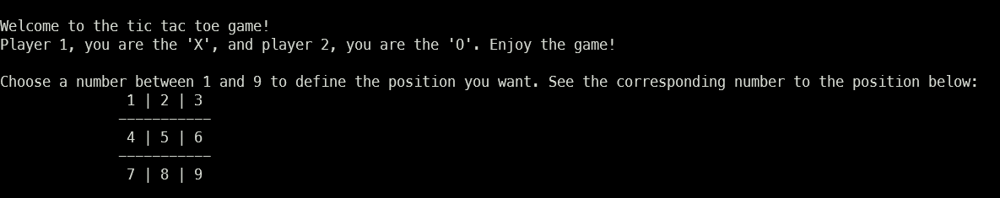

# Tic Tac Toe Game

Este repositório se trata de um trabalho para a matéria "IMD0246 - TÓPICOS ESPECIAIS EM SISTEMAS DE INFORMAÇÃO DE GESTÃO G", onde o tópico trabalhado foi programação em Rust.

# Requisitos
- Para poder compilar e rodar esta aplicação, o usuário deve ter instalado o rustc e o cargo.
- Para mais informações de como instalar, veja: https://doc.rust-lang.org/book/ch01-01-installation.html
# Compilando e executando
- No terminal, acesse a pasta do projeto e ponha o comando `cargo run`. Após isso, o programa será compilado e executado.

# Como jogar

- O jogo irá iniciar mostrando a mensagem abaixo:

- Para jogar, basta digitar o número que corresponde a posição em que o jogador deseja colocar o `X` ou o `O`.

- Não são permitidos números abaixo ou iguais zero e nem letras.

- Aproveite o jogo !

---

> Desenvolvido por Yuri Filgueira